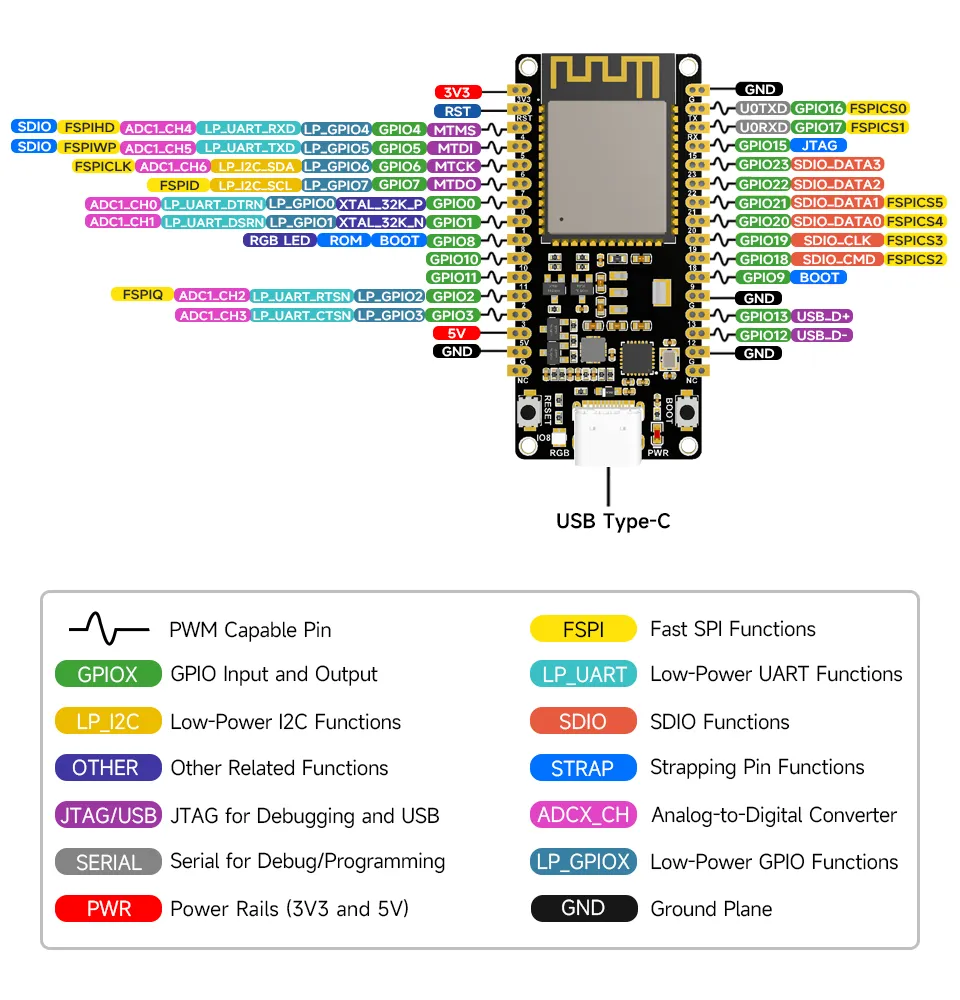

# TerraSense

TerraSense is a smart-terrarium controller built on the ESP32-C6. It provides Home Assistant integration via MQTT to control the environment.

---

## Hardware Requirements/Features
* **Home Assistant Integration:** Uses MQTT Auto-Discovery for all peripherals for Home Assistant integration.
* **Custom PCB:** We used a custom PCB to keep everything clean
* **Sensor Support:**
  * **I²C:** SHT35 series (Temperature & Humidity) via multiplexer(TCA9548A).
  * **OneWire:** DS18B20.
  * **Binary:** Binary liquid level sensor(XKC-Y25-NPN).
* **Actuator Support:**
  * **GPIO:** GPIO relays and Solid State Relays (SSR) for heaters, lights, and misting pumps.
  * **Fans:** supporting 3 and 4 pin fans

---

## Wiring & Pinout

The hardware configuration as defined in `sys_config.h`. 

| Interface | Component / Name | ESP32-C6 Pin | Notes |
| :--- | :--- | :--- | :--- |
| **I²C Bus** | SDA / SCL | GPIO 5 / GPIO 6 | up to 6 SHT35 sensors supported by I²C Mux |
| **OneWire** | DS18B20 Probe | GPIO 4 | up to 8 DS18B20 sensors |
| **Binary** | Liquid Level Sensor | GPIO 11 | - |
| **GPIO Output** | 4 230V Relais(one SSR) | GPIO 7/0/1/10 | - |
| **Fan** | either MOSFET or PWM | GPIO 18-23 | two fan connectors on pcb |

*(Note: Every pin assignment, default state, and active-high/low logic can be customized in `sys_config.h`.)*

---

## Installation & Setup

### 1. Prerequisites
Ensure you have the [ESP-IDF framework](https://docs.espressif.com/projects/esp-idf/en/latest/esp32/get-started/) installed and configured on your machine.

### 2. Setup
Depending on where your ESP-IDF is installed run the following to activate ESP-IDF environment:
```bash
. $HOME/.espressif/tools/activate_idf_v6.0.sh
```
Before touching any configrations, we need to set network and MQTT broker specifics by running the following command in the root dir of our project:
```bash
idf.py menuconfig
```
### 3. Configuration
Before compiling, open `/components/sys_config/include/sys_config.h` to define the specific setup.
* **MQTT Topics:** Set `MQTT_DOMAIN_PREFIX` and `TERRARIUM_ID` which are used by macros for the topics.
* **Enable/Disable Hardware:** See the [Hardware Configuration](#hardware-configuration) section.
* **Logic Implementation:** `components/app_logic/app_logic.c` is used to define the control logic.

### 4. Build and Flash
Run the standard ESP-IDF commands to compile and flash to your board(either through terminal with `idf.py` commands or through VsCode buttons).

---

## OTA Update Support

The device supports OTA updates triggered via MQTT by publishing the location of the new binary to `<your_mqtt_base_topic>/cmd/update`.

### To locally test OTA updates

Build the project normally. Navigate to the build folder and start a temporary HTTP server(here just a tiny ruby server available under localhost:8070):

```bash
cd build
ruby -run -e httpd . -p 8070
```
The payload then looks like this:
```text
http://<your_ip>:8070/firmware.bin
```


# Hardware Configuration

Hardware and pin configurations are defined in `components/sys_config/include/sys_config.h`. We provide struct for all configurable peripherals of this project which are explained in more detail.
To keep MQTT topics somewhat consistent, we have define an MQTT scheme in `components/sys_config/mqtt_namingscheme.md`. One only has to define `MQTT_DOMAIN_PREFIX`, `TERRARIUM_ID` and the respective sensor and actuator structs. Everything else is handled by the implementation.

> If one wishes to change or extend the MQTT autodiscovery logic, one could define it through `components/app_logic/app_logic.c` and `components/net_mqtt/hass_discovery.c`.
---

## One-Wire Bus (DS18B20)
- GPIO Configuration `ONEWIRE_BUS_GPIO` defines the GPIO used for One-Wire sensors such as DS18B20 temperature sensors.
- Add DS18B20 sensors with unique mqtt device ID and unique ROM address
```c
static const ds18b20_target_t HARDWARE_DS18B20_CONFIG[] = {
    {
        .name = "Temporary DS18B20 Sensor",
        .mqtt_device_id = "ds18b20_temporaryplaceholder",
        .rom_address = 0x133C6CF64930E728
    },
};
```
>We also provide a custom ESP-IDF project for discovering one-wire DS18B20 sensors to find the addresses.

---

## I²C Bus (SHT35)
- GPIO Configuration `I2C_SDA_GPIO` and `I2C_SCL_GPIO` defines the GPIO pins used for the I²C bus
- Add SHT35 sensors using a channel(0-5 are supported):
```c
static const sht3x_target_t HARDWARE_SHT3X_CONFIG[] = {
    {
        .name = "SHT35 Test Sensor",
        .mqtt_device_id = "sht35_ambient_test",
        .mux_channel = 0
    },
};
```

---

##  Binary Sensor (XKC-Y25-NPN)
- GPIO Configuration `.gpio_pin` defines the GPIO used for the binary liquid level sensor.
- The PCB currently supports only one binary sensor, however one could extend the list
```c
static const binary_sensor_target_t HARDWARE_BINARY_CONFIG[] = {
    { .name = "Tank Empty", .mqtt_device_id = "liquid_level_sensor", .gpio_pin = BINARY_SENSOR_GPIO, .invert_logic = true },
};
```

---

##  Hardware Switch (3 normal relais, one SSR)
- GPIO Configuration `.gpio_pin` defines the GPIO used for the binary liquid level sensor.
```c
static const switch_target_t HARDWARE_SWITCH_CONFIG[] = {
    { .name = "Lights", .mqtt_device_id = "lights", .gpio_pin = RELAY_0_GPIO, .active_high = true, .default_state = false },
};
```

---

##  Fans (3 and 4 pin fans)
- GPIO Configuration `.power_pin` defines the GPIO used to control the power for a 3 pin fan over a MOSFET
- GPIO Configuration `.pwm_pin` defines the GPIO used for PWM control of a 4 pin fan.
- `.tach_pin` only got us meaningful results on 4 pin fans, therefore `FAN_UNUSED_PIN` for 3 pin fans.
```c
static const fan_target_t HARDWARE_FAN_CONFIG[] = {
    { .name = "Fan", .mqtt_device_id = "fan", .power_pin = FAN0_POWER_PIN, .tach_pin = FAN0_TACH_PIN, .pwm_pin = FAN0_PWN_PIN, .is_4pin = true },
    { .name = "temp three Fan", .mqtt_device_id = "fan_three", .power_pin = FAN0_POWER_PIN, .tach_pin = FAN_UNUSED_PIN, .pwm_pin = FAN_UNUSED_PIN, .is_4pin = false },
};
```

---

##  Numbers for Home Assistant
- This struct could be used to define target temperatures which could be changed and controlled form the Home Assistant UI.
```c
static const number_target_t HARDWARE_NUMBER_CONFIG[] = {
    { 
        .name = "Target Temperature Day", 
        .mqtt_device_id = "target_temp_day", 
        .min_val = 20.0, 
        .max_val = 32.0, 
        .step = 0.5, 
        .default_val = 28.0, 
        .mode = "slider"
    }
};

```


# ESP32-C6 Infos

[ESP32-C6 pinout information](https://docs.waveshare.com/ESP32-C6-DEV-KIT-N8/ "esp32-c6-pinout")

