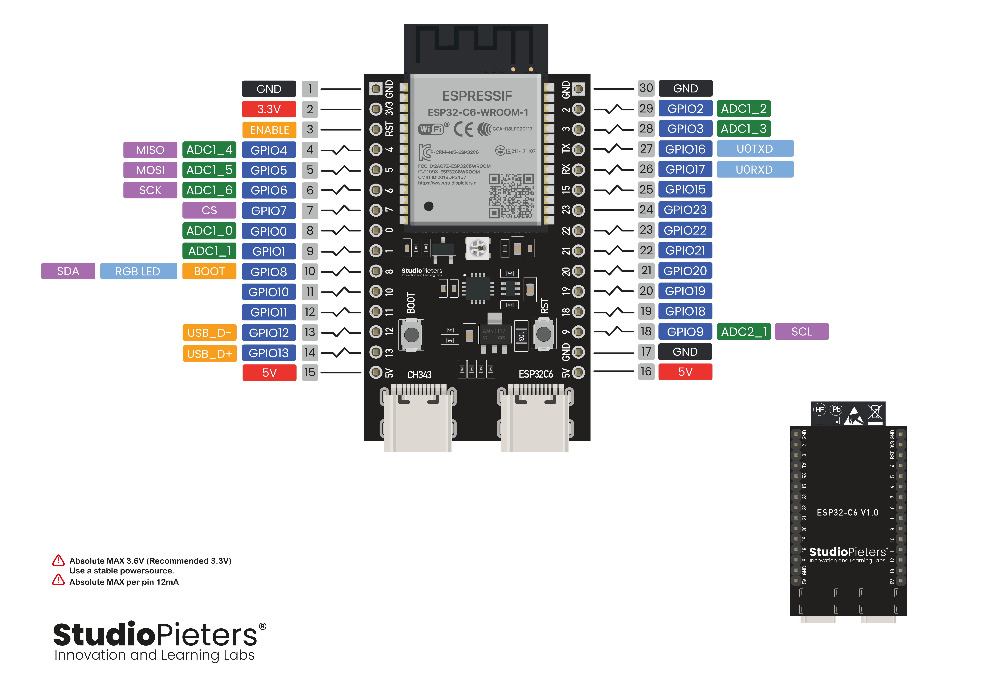

# Terrasense Project

## Important commands
To activate idf env for shell depending where your idf lies on your machine:
```bash
. $HOME/.espressif/tools/activate_idf_v6.0.sh
```
to be able to use `idf.py <something>` commands

**Configuration** | `idf.py menuconfig` this needs to be run once before hand to enter wifi and mqtt specifics. Important: `idf.py menuconfig` needs to be run in project root folder.

**full clean** | `idf.py fullclean` no idea how this is done in the IDE

## for OTA update by fetching binary from http server via mqtt trigger:
- build new binary, `cd build` and `ruby -run -e httpd . -p 8070` or any port of your choice to host firmware
- trigger update via mqtt, topic: `your_mqtt_basetopic+cmd/update` and payload: `http://<your_ip>:8070/newFirmware.bin`

## Hardware/Pin Configurations:
`components/sys_config/include/sys_config.h`is responsible for all pin configurations except the debug LED, 

### One-Wire Bus

- `ONEWIRE_BUS_GPIO` defines the GPIO pin used for One-Wire sensors like DS18B20
- The struct below is used to define the DS18B20 sensors with their name and corresponding address, the rest is handled in sensors component

```c
static const ds18b20_target_t HARDWARE_DS18B20_CONFIG[] = {
    { .name = "Temporärer Temp DS18B20-Sensor", .mqtt_device_id = "ds18b20_temporaryplaceholder", .rom_address = 0x133C6CF64930E728 },
    // { .name = "xyz Temp", .mqtt_device_id = "ds18b20_temporaryplaceholder", .rom_address = 0x... }
};
```

### I²C
- `I2C_SDA_GPIO` and `I2C_SCA_GPIO` defines the GPIO pin used for I²C sensors like SHT35
- The struct below is used to define the SHT35 sensors with their (mqtt_dvice_id)name and corresponding channel for TCA9548A multiplexer, the rest is handled in sensors component
```c
static const sht3x_target_t HARDWARE_SHT3X_CONFIG[] = {
    { .name = "SHT35 testsensor", .mqtt_device_id = "sht35_ambient_test", .mux_channel = 0 },
    // { .name = "SHT35 Hot Side", .mqtt_device_id = "sht35_hot", .mux_channel = 1 },
};
```


## ESP32-C6 Infos

[ESP32-C6 pinout information](https://www.studiopieters.nl/esp32-c6-pinout/ "esp32-c6-pinout")
